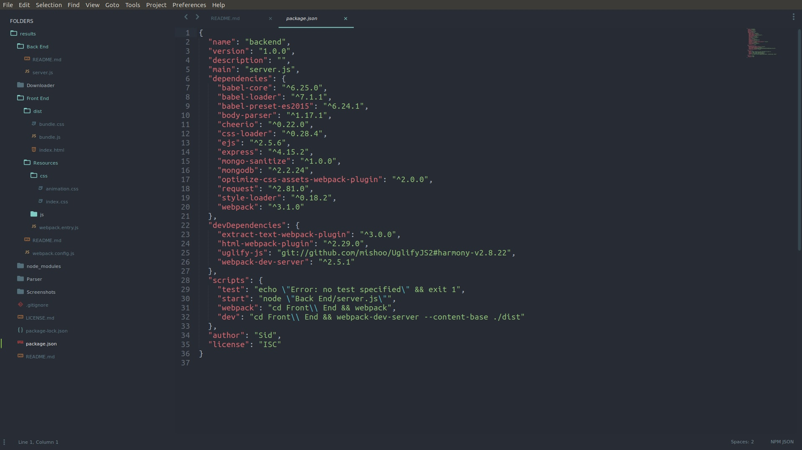
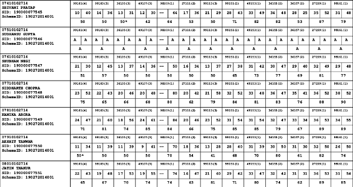
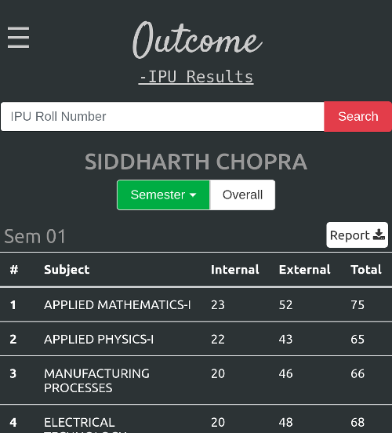
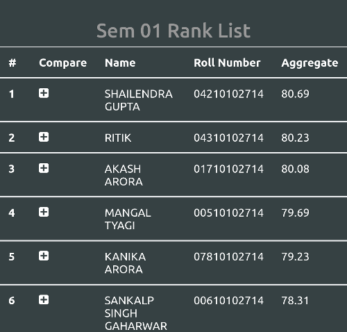

# Outcome for IPU

A single page [web app](https://outcome-ipu.herokuapp.com) that provides results to IP University students in a tabular form and also displays the class ranks, university ranks, aggregate result summary of the student. One can also download their individual result in a PDF form and use it when offline. All it needs is the student's Roll Number and it fetches all the results available in the database.

## Folder Structure

Your project should look like this initially:

## Available Scripts

In the project directory, you can run:

### `npm install`

To set up the project, and install all the required repositories.

### `npm start`

Runs the app in the development mode. 
Open [http://localhost:3001](http://localhost:3001) to view it in the browser.

The page will reload if you make edits. 
You will also see any lint errors in the console.

### `npm test`

Launches the test runner in the interactive watch mode. 
See the section about [running tests](#running-tests) for more information.

### `npm run build`

Builds the app for production to the `build` folder. 
It correctly bundles React in production mode and optimizes the build for the best performance.

The build is minified and the filenames include the hashes. 
Your app is ready to be deployed!

## Stepts to set up locally 

1. Fork the project and clone it on your local mcahine.

2. Open terminal in the root folder (containing the package.json file) in this case, results itself.

3. Run 'npm install' (without inverted commas) to download all the required dependencies (make sure u have NodeJs installed)

4. Run the server using 'npm start'. 

### From

### To
Result             |  Rank List
:-------------------------:|:-------------------------:
  |  

### Features
1. Results of all CSE, IT, ECE, EEE, MAE students starting from 2014 Batch, some results are also available for 2013 batch.
2. Mobile friendly, using Bootstrap v4.
3. Chrome add to home screen feature and theme color for Chrome on Android.
4. Now added downloadable reports, view your result when offline!
5. Credit percentage 
6. Comparison tables of students in a class.

### Stack
##### 1. Backend
	- Node.js for parsing.
	- Express for serving files.
	- MongoDB for storing data. 

##### 2. Frontend
	- Bootstrap.
	- Vanilla Javascript.
	- Some external libs for report generation and saving.

### Version 1.2
Added downloadable reports and slight front end redesign.

### Bug Watchers
[Vibhor Agrawal](https://github.com/vibhor1997a) - PDF reports aggregate problem.  
[Nikhil Yadav](https://github.com/sam1803) - PDF parsing.

### Contributors
[Manika Shrivastava](https://about.me/manikashrivastava) - Analytics support, feature/layout suggestions and many B.Tech result PDFs.  
[Natasha Malik](https://github.com/NatashaMalik-50) - All MCA result PDFs.  
Raghav Sharma - Link sharing and awareness creation for the project.  

### Note

* The parsers support parsing of any IPU Result of any course, so raise an issue if you want your course result to be displayed here.
* Works best on Chrome and Firefox.
